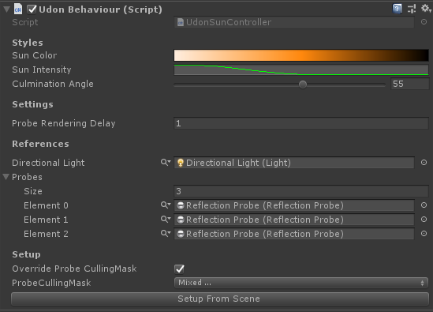

# UdonSunController

**You can download latest unitypackage from [here](https://github.com/esnya/UdonSunController/releases/latest)!!**

Bright daylight, Reddish sunsets or Dark night...

UdonSunController provides the ability to freely control the Directional Light at runtime for your VRChat Udon world. Just place the prefab in your scene. It automatically controls the brightness and color temperature from the direction of sun. Reflection probes can also be re-baked.

## Requirements
Update to latest version.

* VRCSDK3_WORLD
* [UdonSharp](https://github.com/MerlinVR/UdonSharp)

## Usage
1 Put `Assets/UdonSunController/SunController.prefab` into the scene.
2 Press `Setup Fom Sene` Button on the inspector of placed `SunController`.

### When you added new Reflection Probe (s)
1. Press `Setup From Scene` again.

## Migration from v2.x to v3.x.
* Directional Light has been removed from the prefab. Add to your scene manually or keep the initially created one.
* The ReflectionProbeUpdator has been removed, please remove the UdonBehaviour that references it that you added to ReflectionProbe. UdonSunController will now update them directly.

## License
MIT License

## Gallary

