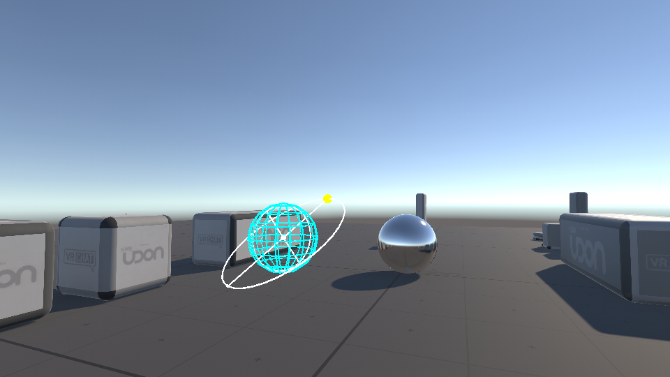
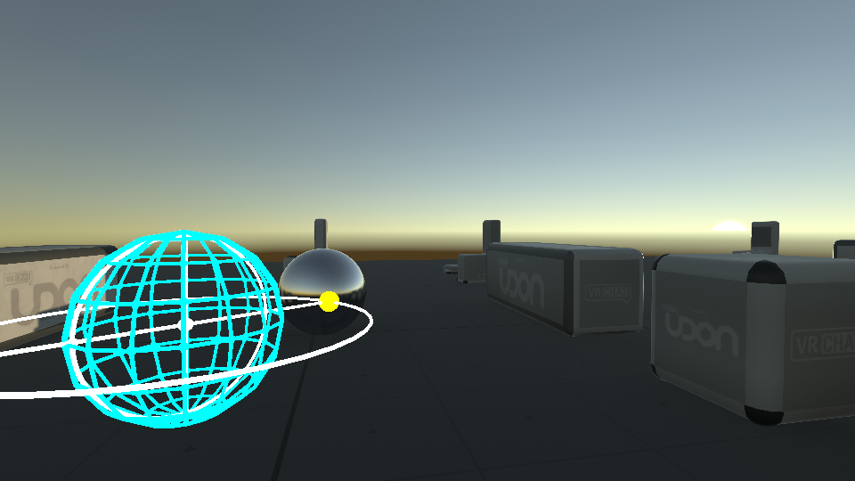
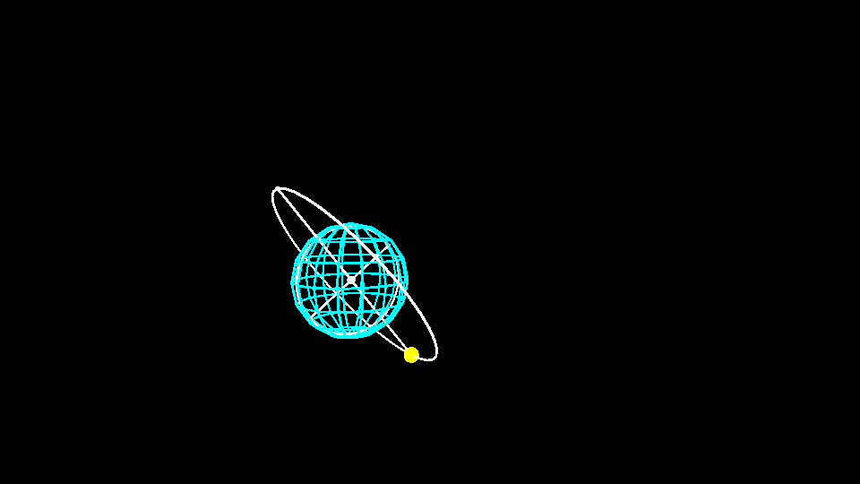

# UdonSunController

**You can download latest unitypackage from [here](https://github.com/esnya/UdonSunController/releases/latest)!!**

Bright daylight, Reddish sunsets or Dark night...

UdonSunController provides the ability to freely control the Directional Light at runtime for your VRChat Udon world. Just place the prefab in your scene. It automatically controls the brightness and color temperature from the direction of sun. Reflection probes can also be re-baked.

## Requirements
* VRCSDK3 WORLD 2021.01.19.07.28
* [UdonSharp](https://github.com/MerlinVR/UdonSharp) v0.19.2
* [UdonToolkit](https://github.com/orels1/UdonToolkit) v0.5.0

## Usage
1. Remove Directional Light and Reflection Probes from your scene.
2. Put `Assets/UdonSunController/SunController.prefab` into the scene.
3. Open Lighting Window and set `SunController/Armature/Root/Rotation/Directional Light` into `Sun Source`.

### Adding Reflection Probe
1. Set the Reflection Probe to `Type = Realtime` and `Reflesh Mode = Via scripting`.
2. Add `Reflection Probe Controller` UdonBehaviour to it.
3. Add it to the `On Drop Target List` of the UdonBehaviour in `SunController2/Handle`.

## License
MIT License

## Gallary

